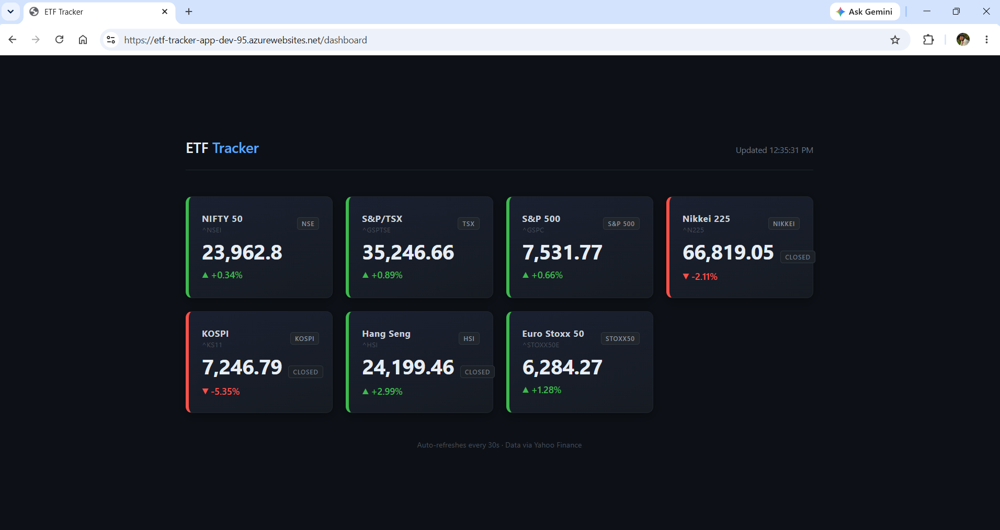
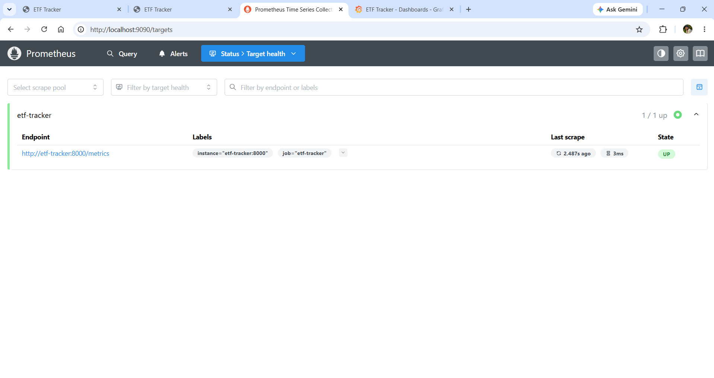

# 📈 Multi-Market ETF Tracker: A DevOps Showcase

> A fully automated, cloud-native application that tracks real-time price data for 7 major global market indexes (NIFTY 50, S&P/TSX, S&P 500, Nikkei 225, KOSPI, Hang Seng, Euro Stoxx 50) — built to demonstrate a complete DevOps lifecycle from local development to cloud deployment.

---

## 📖 Project Overview

This project monitors real-time market data for 7 major global indexes: **NIFTY 50** (India), **S&P/TSX Composite** (Canada), **S&P 500** (US), **Nikkei 225** (Japan), **KOSPI** (South Korea), **Hang Seng** (Hong Kong), and **Euro Stoxx 50** (Europe).

The application is a **Flask web service** (served via gunicorn) with two HTTP endpoints: a `/` route that returns live ETF market data as JSON, and a `/health` route for App Service health checks. It is deployed as an Azure Linux Web App, pulling a Docker image from Docker Hub.

The focus of this repository is not just the Python application itself, but the **end-to-end DevOps lifecycle**: from local development and containerization, to automated cloud infrastructure provisioning using Infrastructure as Code (IaC).

---

## 🌐 Live Deployment

| Endpoint | URL |
|----------|-----|
| Market Data (JSON) | https://etf-tracker-app-dev-95.azurewebsites.net/ |
| Health Check | https://etf-tracker-app-dev-95.azurewebsites.net/health |



---

## 🏗️ Architecture & Workflow

```
Develop → Test → Package → Ship → Provision → Automate
```

| Stage | Description |
|-------|-------------|
| **Develop** | Flask web service monitors financial markets using real-time APIs and returns JSON responses |
| **Test** | pytest suite (8 tests) runs against mocked yfinance calls — no network dependency |
| **Package** | Application is containerized with Docker for environment parity |
| **Ship** | Versioned images pushed to Docker Hub (`devesh0905/etf-tracker`), tagged with both `latest` and git SHA |
| **Provision** | Terraform creates Azure Resource Group, VNet, and Linux Web App in `canadacentral` |
| **Automate** | GitHub Actions runs three jobs in sequence on every push to `main`: **tests → Docker build/push → Terraform fmt/validate/plan** (read-only). A failing test blocks the Docker build entirely. `terraform apply` is run manually by the developer — ephemeral CI runners can't share local Terraform state |

---

## 🛠️ Tech Stack

| Layer | Technology |
|-------|------------|
| Language | Python 3.11 |
| Web Framework | Flask |
| WSGI Server | gunicorn |
| Testing | pytest, pytest-mock |
| Metrics | Prometheus (`prometheus-client`) |
| Observability UI | Grafana |
| Alerting | Grafana → Telegram (built-in integration) |
| Containerization | Docker |
| Container Registry | Docker Hub |
| Infrastructure (IaC) | Terraform |
| Cloud Provider | Microsoft Azure (App Services) |
| CI/CD | GitHub Actions |

---

## 🚀 Deployment Guide

### Prerequisites
- Azure CLI installed and authenticated (`az login`)
- Docker installed and running
- Terraform installed (`>= 1.0`)
- Docker Hub account

### Step 1 — Build & Push the Docker Image

```bash
docker build -t etf-tracker ./app
docker tag etf-tracker devesh0905/etf-tracker:latest
docker push devesh0905/etf-tracker:latest
```

### Step 2 — Provision Azure Infrastructure

```bash
terraform init
terraform apply -auto-approve
```

### Step 3 — Test the running service

```bash
# Local (after docker run -p 8000:8000 devesh0905/etf-tracker)
curl http://localhost:8000/
curl http://localhost:8000/health

# Live Azure deployment
curl https://etf-tracker-app-dev-95.azurewebsites.net/
curl https://etf-tracker-app-dev-95.azurewebsites.net/health
```

The `/` endpoint returns a JSON array like:
```json
[
  {"ticker": "^NSEI",     "price": 23962.80, "change_pct":  0.34, "market_status": "open"},
  {"ticker": "^GSPTSE",   "price": 35226.77, "change_pct":  0.83, "market_status": "open"},
  {"ticker": "^GSPC",     "price":  7530.95, "change_pct":  0.64, "market_status": "open"},
  {"ticker": "^N225",     "price": 66819.05, "change_pct": -2.11, "market_status": "closed"},
  {"ticker": "^KS11",     "price":  7246.79, "change_pct": -5.35, "market_status": "closed"},
  {"ticker": "^HSI",      "price": 24199.46, "change_pct":  2.99, "market_status": "closed"},
  {"ticker": "^STOXX50E", "price":  6284.27, "change_pct":  1.28, "market_status": "open"}
]
```

If a ticker fetch fails (network error, missing data), that entry includes an `"error"` field instead of price/change, and the rest of the tickers are still returned.

---

## 🧬 Testing

Tests live in `app/test_tracker.py` and run via pytest. All yfinance calls are mocked — the suite has no network dependency and completes in under 2 seconds.

```bash
pip install -r app/requirements.txt -r app/requirements-dev.txt
pytest app/test_tracker.py -v
```

**8 tests covering:**

| Test | What it verifies |
|------|-----------------|
| `test_market_summary_returns_200` | `GET /` returns HTTP 200 |
| `test_market_summary_returns_json_array` | Response is a JSON array with all 7 tickers and correct keys |
| `test_health_returns_200` | `GET /health` returns HTTP 200 |
| `test_metrics_returns_200` | `GET /metrics` returns HTTP 200 |
| `test_metrics_contains_expected_metric_names` | Prometheus output contains `etf_requests_total` and `etf_ticker_fetch_success` |
| `test_one_failed_ticker_still_returns_200` | One bad ticker fetch does not crash the endpoint |
| `test_failed_ticker_has_error_field` | Failed ticker gets an `"error"` key with no `"price"` key |
| `test_other_tickers_unaffected_by_one_failure` | The remaining 6 tickers still return valid price data |

In CI, the test job runs first. If any test fails, the Docker build and Terraform apply are skipped entirely.

---

## 📊 Monitoring

### Azure (Production)

Application logs can be monitored in real-time via the **Azure Portal Log Stream**. The gunicorn server logs each request; the application logs each ticker fetch attempt, success, and failure using Python's standard `logging` module. Fetch errors are visible in the log stream without crashing the service.

### Local Observability Stack

A full local monitoring stack is included for development and demo purposes. It runs via Docker Compose and is **not deployed to Azure**.

```bash
# Create .env with your bot token first (see .env.example)
docker compose up --build
```

| Service | URL | Description |
|---------|-----|-------------|
| Flask app | http://localhost:8000 | Live ETF market data JSON |
| Prometheus | http://localhost:9090 | Metrics scraping UI |
| Grafana | http://localhost:3000 | Dashboard (auto-loads on startup) |

**Prometheus** scrapes `/metrics` every 15 seconds, collecting:
- `etf_requests_total` — total requests to `/`
- `etf_request_duration_seconds` — request latency histogram
- `etf_ticker_fetch_success{ticker="..."}` — gauge per ticker (1 = success, 0 = failure)

**Grafana** is fully provisioned on startup via `grafana/provisioning/` — no manual UI setup needed. The dashboard (`grafana/etf-tracker-dashboard.json`) includes four panels:
- **Total Requests** — stat panel showing cumulative request count
- **Ticker Health** — per-ticker stat panel (green = UP, red = DOWN)
- **P95 Request Latency** — time series of 95th percentile latency
- **Ticker Fetch Success Over Time** — step-line chart, one line per ticker

**Grafana Alerting** is wired to a Telegram bot via the built-in Telegram integration. If any ticker's fetch success gauge drops to 0 and stays there for more than 1 minute, a real-time alert message is sent to Telegram. Recovery messages are also sent when the ticker comes back up. This was tested and confirmed working end-to-end.




---

## 🧪 Troubleshooting & Lessons Learned

Real-world cloud deployments rarely go smoothly. Here are the major architectural hurdles encountered and resolved during this project:

### 1. Navigating Regional Cloud Quotas

**Challenge:** Encountered `401 Unauthorized` errors when deploying to `eastus` due to subscription-level limitations on Free Tier (F1) resources.

**Solution:** Refactored Terraform configuration to migrate the entire stack to `canadacentral`, ensuring 100% resource availability while remaining within free tier budget constraints.

---

### 2. Resolving Docker Registry Path Conflict

**Challenge:** Azure App Service logs reported `BadRequest` and `invalid reference format` errors during the Docker image pull phase.

**Solution:** Identified a syntax conflict where Azure was prepending extra slashes to the image name. Resolved by explicitly defining the Docker V1 Registry URL (`https://index.docker.io/v1`) within the Terraform `application_stack` block.

```hcl
application_stack {
  docker_registry_url = "https://index.docker.io/v1"
  docker_image_name   = "devesh0905/etf-tracker:latest"
}
```

---

### 3. One-Shot Script vs. Long-Running Web Server

**Challenge:** The original `tracker.py` was a console script that printed ETF data to stdout and exited. Deployed as an Azure Linux Web App (which expects a persistent HTTP server), the container would start, exit immediately, and crash-loop indefinitely — the app never actually served traffic.

**Solution:** Converted the application to a Flask web service with gunicorn as the WSGI server. The existing yfinance market-data logic was kept intact and wrapped in a `/` route returning JSON. A `/health` route was added for App Service health checks. The Dockerfile CMD was updated from `python tracker.py` to `gunicorn --bind 0.0.0.0:8000 tracker:app`.

---

### 4. Terraform State File Hygiene

**Challenge:** `terraform.tfstate` (and its backup) were committed to git early in the project. State files can contain sensitive resource identifiers and should never be in version control.

**Solution:** The files were removed from git tracking using `git rm --cached` and `.gitignore` was verified to exclude `*.tfstate` and `*.tfstate.backup`. The files remain on disk for local use but are no longer tracked. The correct long-term fix is a remote backend (e.g. Azure Blob Storage) so state is shared, locked, and never touches the local filesystem.

---

## 📁 Project Structure

```
.
├── main.tf                        # Core Terraform resources (App Service, VNet, RG)
├── providers.tf                   # AzureRM provider configuration (local state)
├── variables.tf                   # Input variables (location, app name, SKU, image)
├── .gitignore                     # Excludes .tfstate, .env, __pycache__, .terraform/
├── .env.example                   # Required environment variable keys (no secrets)
├── docker-compose.yml             # Local observability stack (Flask + Prometheus + Grafana)
├── prometheus.yml                 # Prometheus scrape config (targets etf-tracker:8000)
├── .github/
│   └── workflows/
│       └── terraform.yml          # CI/CD: test → Docker build/push → Terraform
├── grafana/
│   ├── etf-tracker-dashboard.json # Auto-provisioned Grafana dashboard (4 panels)
│   └── provisioning/
│       ├── datasources/           # Prometheus datasource (auto-wired on startup)
│       ├── dashboards/            # Dashboard loader config
│       └── alerting/              # Telegram contact point + alert rule + routing policy
└── app/
    ├── Dockerfile                 # python:3.11-slim + gunicorn
    ├── requirements.txt           # Pinned production dependencies
    ├── requirements-dev.txt       # pytest + pytest-mock (not included in Docker image)
    ├── tracker.py                 # Flask web service + Prometheus metrics
    └── test_tracker.py            # pytest suite (8 tests, all yfinance calls mocked)
```

---

## 👤 Author

**Devesh Chowdary Chalasani**  
Cloud & DevOps Engineer  
[LinkedIn](https://linkedin.com/in/) • [Docker Hub](https://hub.docker.com/u/devesh0905)
